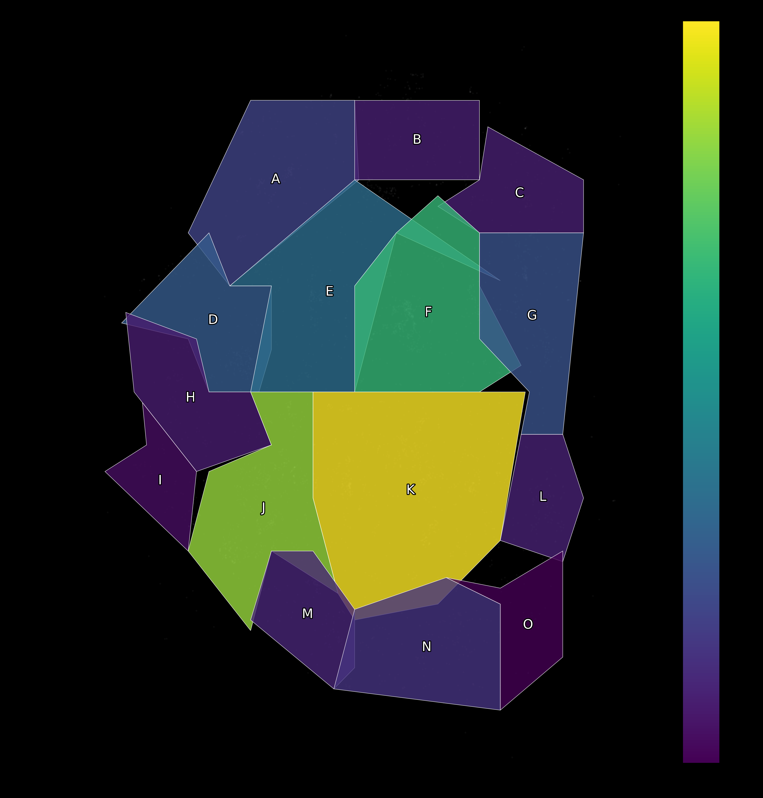
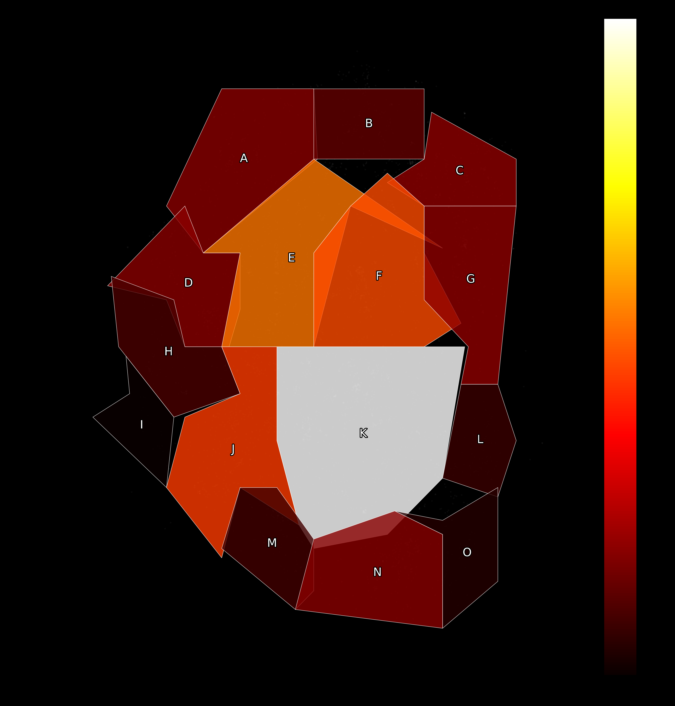

# COD Caldera Player Path Analysis

This project analyzes player movement data from the Call of Duty: Warzone Caldera map. It leverages Activision's public map data and custom-defined Points of Interest (POIs) to:

- 📍 Identify the most popular landing zones  
- 🧠 Measure average survival time by landing location  
- 💀 Visualize player death hotspots  

---

## 📁 Project Structure

```
CalderaMapAnalysis/
│
├── data/                    # Map boundaries and extracted player data  
│   ├── CalderaCoordinates.xlsx  
│   └── caldera_breadcrumbs.csv   ← Generated from USD file (not included here)  
│
├── src/                     # Main analysis and data extraction scripts  
│   ├── CalderaEndpointDownload.py  
│   └── CalderaEndpointAnalysis.py  
│
├── outputs/                 # Heatmaps and summary visualizations  
├── requirements.txt         # Python dependencies  
├── .gitignore  
└── README.md
```

---

## ⚙️ How to Run

### 1. Install dependencies

```bash
pip install -r requirements.txt
```

### 2. Extract the player movement data

```bash
python src/CalderaEndpointDownload.py
```

> This will generate `caldera_breadcrumbs.csv` in the `data/` folder.  
> Make sure to update `usd_file_path` in the script to point to your local `.usda` file.

### 3. Run the analysis and generate visuals

```bash
python src/CalderaEndpointAnalysis.py
```

---

## 📊 Results Overview

### 🔥 Most Popular Landing Zones

| POI Name | Players |
|----------|---------|
| K Fields | 825     |
| J Airfield | 702   |
| F Peak   | 565     |
| E Mines  | 318     |
| D Ruins  | 264     |

### 🧠 Safest Landing Zones (Highest Avg. Survival)

| POI Name | Avg Survival Time | Survival Score |
|----------|-------------------|----------------|
| A Arsenal | 417.2            | 100            |
| I Lagoon | 403.7            | 87             |
| M Power Plant | 389.1       | 73             |
| H Village | 382.2           | 66             |
| B Docks   | 376.7           | 61             |

### ☠️ Deadliest POIs (Most Deaths Recorded)

| POI Name | Deaths |
|----------|--------|
| K Fields | 954    |
| E Mines  | 526    |
| F Peak   | 467    |
| J Airfield | 445  |
| G Beachhead | 208 |

---

## 🌍 Visualizations

All visualizations are saved in the `/outputs/` folder as `.png` images.

- 🔺 Player Count by Landing POI


- 🎯 Survival Score by POI
.png)

- 💣 Death Count by POI


---

## 🧪 Methodology

- Breadcrumb data was extracted from Caldera's `.usda` replay files  
- Custom POIs were defined using polygon shapes in Excel  
- **Landing location** = lowest Z position within first 45 frames  
- **Survival time** = max `time_step` per player  
- **Player deaths** = last recorded breadcrumb with valid life value  

---

## ⚠️ Data Notes & Limitations

- This is not full match data – only players found in the `.usda` replay files  
- POIs were manually drawn and may not match in-game boundaries exactly  
- Survival time is based on last breadcrumb, not guaranteed time-of-death  
- Redeploys may be included but are not currently filtered  

---

## 🚧 Future Enhancements

- Add interactive dashboard (e.g., Plotly, Streamlit)  
- Automatically detect redeploys / kills  
- Cluster deaths into "hot zones" within POIs  
- Modularize map rendering and POI processing  

---

## 🙌 Credits

Created by **Sam Johnston**  
Data from **Activision’s Warzone Caldera** open data release

